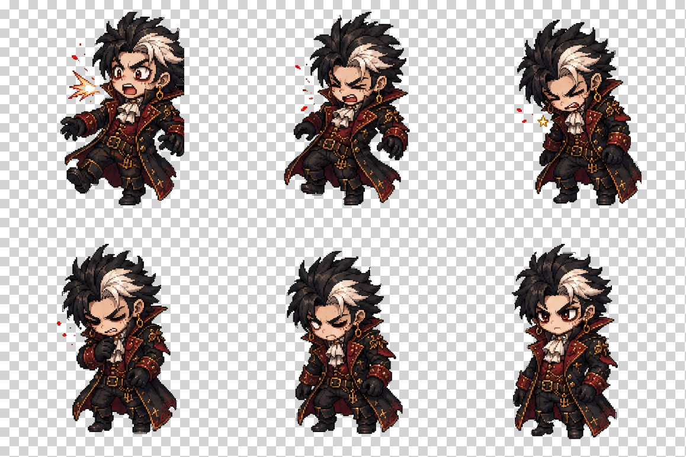

# Remove BG Skill

[中文](README.md) | [English](README.en.md)


`remove-bg` 是一个同时支持 Codex 和 Claude Code 的本地抠图 Skill。它面向游戏素材、像素帧、商品图、人像和需要类似 remove.bg 效果的图片处理任务，默认输出透明 PNG，并把结果保存到源图片所在目录。

它不是简单删除所有黑色像素，而是把抠图流程拆成两条标准路径：游戏帧/像素图使用确定性的 PowerShell 像素流程，保留角色描边、头发、衣服和阴影；自然照片/复杂背景使用 `rembg` 模型路径，支持 alpha matting。

---

## 图文介绍

### 游戏帧黑底透明化



棋盘格预览用于确认背景已经透明，主体和近身特效仍然保留。

---

## 适用场景

适合触发这个 Skill 的请求：

```text
把这些游戏帧的黑色背景扣除并保存到原地址
```

```text
帮我给这张图去背景，输出透明 PNG
```

```text
批量抠图，效果参考 remove.bg
```

不适合触发的请求：

- 只是想换一个创意背景。
- 只是压缩、裁剪、改尺寸。
- 希望 AI 重绘主体，而不是保留原始素材。

---

## 前置条件

### 游戏帧 / 像素图

Windows PowerShell 即可，不需要 Python，不需要联网。

### 自然照片 / 商品图 / 人像

需要 Python 和 `rembg`：

```powershell
py -3 -m pip install -r .\remove-bg\requirements.txt
```

首次运行 `rembg` 可能需要下载模型权重。

---

## 安装

### 最简单方式：让 AI Agent 按 URL 安装

如果你正在使用 Codex 或 Claude Code，可以直接把下面这句话发给 Agent：

```text
帮我安装这个 skill：https://github.com/VioletScar-Hui/Removebg/tree/main/remove-bg
```

英文也可以直接这样说：

```text
Install this skill: https://github.com/VioletScar-Hui/Removebg/tree/main/remove-bg
```

安装后重启 Codex 或 Claude Code，让 Skill 索引重新加载。

### Codex

```powershell
$repoPath = "$env:USERPROFILE\.agents\skill-repos\Removebg"
$skillPath = "$env:USERPROFILE\.agents\skills\remove-bg"
New-Item -ItemType Directory -Force -Path (Split-Path $repoPath) | Out-Null
if (Test-Path "$repoPath\.git") {
  Set-Location $repoPath
  git pull --ff-only
} elseif (Test-Path $repoPath) {
  Write-Error "$repoPath already exists but is not a git repository. Move it aside or choose a different repoPath."
  exit 1
} else {
  git clone https://github.com/VioletScar-Hui/Removebg.git $repoPath
}
New-Item -ItemType Directory -Force -Path $skillPath | Out-Null
Copy-Item -Path "$repoPath\remove-bg\*" -Destination $skillPath -Recurse -Force
```

### Claude Code

```powershell
$repoPath = "$env:USERPROFILE\.claude\skill-repos\Removebg"
$skillPath = "$env:USERPROFILE\.claude\skills\remove-bg"
New-Item -ItemType Directory -Force -Path (Split-Path $repoPath) | Out-Null
if (Test-Path "$repoPath\.git") {
  Set-Location $repoPath
  git pull --ff-only
} elseif (Test-Path $repoPath) {
  Write-Error "$repoPath already exists but is not a git repository. Move it aside or choose a different repoPath."
  exit 1
} else {
  git clone https://github.com/VioletScar-Hui/Removebg.git $repoPath
}
New-Item -ItemType Directory -Force -Path $skillPath | Out-Null
Copy-Item -Path "$repoPath\remove-bg\*" -Destination $skillPath -Recurse -Force
```

---

## 第一次成功运行

对 Codex 或 Claude Code 说：

```text
把 D:\path\frame_00.png 到 frame_05.png 的背景扣除并保存到原地址
```

正常情况下，Agent 应该：

1. 识别这是游戏帧/像素图素材。
2. 使用 `remove_sprite_bg.ps1` 走本地确定性流程。
3. 在源目录生成 `*_removebg.png`。
4. 生成 `remove-bg-checker-contact.png`。
5. 检查透明像素统计和棋盘格预览。
6. 最终只返回简短确认和输出路径。

---

## 核心能力

### 像素素材专用流程

- 删除大面积纯黑或近黑背景连通块。
- 保留角色黑色描边、头发、衣服、阴影和特效。
- 清理孤立的裁切碎片或邻帧残片。
- 生成棋盘格 QA 图，方便快速确认透明背景。

### 照片与复杂背景

- 使用 `rembg` 输出透明 PNG。
- 支持 `--alpha-matting`，适合人像发丝、商品柔边和复杂边缘。
- 默认保留原图，输出 `_removebg.png`。

### 本地优先

- 游戏帧流程不需要联网。
- 默认不上传图片到第三方服务。
- 只有照片模型路径缺依赖或模型权重时，才需要安装或下载。

---

## 验收标准

结果必须满足：

- 背景透明。
- 主体和需要保留的特效仍然可见。
- 没有明显黑色矩形、残留碎片、边缘光晕或主体截断。
- 原始素材未被覆盖。

---

## 仓库结构

```text
Removebg/
  README.md
  README.en.md
  CHANGELOG.md
  assets/
    intro-01-sprite-checker.png
  remove-bg/
    README.md
    SKILL.md
    requirements.txt
    scripts/
      remove_sprite_bg.ps1
      pixel_black_bg_remove.ps1
      cleanup_isolated_components.ps1
      make_checker_contact.ps1
      remove_bg.py
    tests/
      test_remove_bg.py
    evals/
      evals.json
```

---

## 更新方式

### Codex

```powershell
$repoPath = "$env:USERPROFILE\.agents\skill-repos\Removebg"
$skillPath = "$env:USERPROFILE\.agents\skills\remove-bg"
Set-Location $repoPath
git pull --ff-only
New-Item -ItemType Directory -Force -Path $skillPath | Out-Null
Copy-Item -Path "$repoPath\remove-bg\*" -Destination $skillPath -Recurse -Force
```

### Claude Code

```powershell
$repoPath = "$env:USERPROFILE\.claude\skill-repos\Removebg"
$skillPath = "$env:USERPROFILE\.claude\skills\remove-bg"
Set-Location $repoPath
git pull --ff-only
New-Item -ItemType Directory -Force -Path $skillPath | Out-Null
Copy-Item -Path "$repoPath\remove-bg\*" -Destination $skillPath -Recurse -Force
```

---

## 常见问题

### 为什么不直接删除所有黑色像素？

游戏角色经常有黑色描边、头发、衣服和阴影。直接删除所有黑色会破坏主体。这个 Skill 默认删除大面积背景连通块，并保留主体内部黑色细节。

### 为什么输出 PNG？

透明背景需要 alpha 通道，JPG 不能保存透明信息。

### 为什么不覆盖原图？

原图是可回退资产。默认输出 `*_removebg.png`，避免破坏素材工程。
